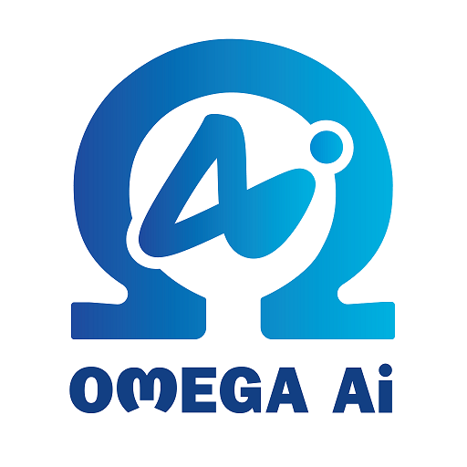

<p align="center">
  <a href="README.md">简体中文</a> | <b>English</b>
</p>

# Build Your Own Deep Learning Framework for Java

Omega-AI is a deep learning framework built in Java. It helps Java developers build, train, and test neural networks while keeping the core implementation close to the underlying algorithms. The project currently supports CPU execution, CUDA acceleration, cuDNN acceleration, and multi-GPU training.

The framework includes implementations and demos for BP neural networks, CNNs, RNNs, VGG16, ResNet, YOLO, LSTM, Transformer, GPT, LLaMA, Diffusion, Stable Diffusion, and DiT-based text-to-image generation. Apart from CUDA/cuDNN-related packages and a small set of utility dependencies, the model and algorithm implementations are written inside this project instead of wrapping another deep learning framework.

## Links

- Official website: [https://oaii.cn](https://oaii.cn)
- Gitee: [https://gitee.com/dromara/omega-ai](https://gitee.com/dromara/omega-ai)
- GitHub: [https://github.com/dromara/Omega-AI](https://github.com/dromara/Omega-AI)
- GitCode: [https://gitcode.com/dromara/omega-ai](https://gitcode.com/dromara/omega-ai)

## Features

- Java-first deep learning engine.
- CUDA and cuDNN GPU acceleration through JCuda.
- Multi-GPU training support.
- Automatic differentiation for CPU and GPU operators.
- Built-in CUDA kernels for common tensor, loss, normalization, attention, and optimizer operations.
- Neural network layers for CNN, RNN/LSTM/GRU, Transformer, GPT, LLaMA, YOLO, VAE, Diffusion, Stable Diffusion, and DiT experiments.
- Training utilities, data loaders, optimizers, learning-rate schedulers, model loading/saving helpers, and visualization-oriented demos.

## Requirements

Omega-AI GPU builds depend on the CUDA version that matches the JCuda version used by the engine package.

For example, if your machine uses CUDA 11.7.x, use the corresponding Omega engine package built for CUDA 11.7.

Check your CUDA version:

```bash
nvcc --version
```

Install CUDA and cuDNN from NVIDIA:

```text
https://developer.nvidia.com/cuda-toolkit-archive
```

The project uses Java 8 source/target compatibility in `pom.xml`.

## Quick Start

Add the Omega engine dependency that matches your CUDA environment:

```xml
<dependency>
    <groupId>io.gitee.iangellove</groupId>
    <artifactId>omega-engine-v4-gpu</artifactId>
    <version>win-cu11.7-v1.0-beta</version>
</dependency>
```

Initialize the CUDA context before running GPU examples, and release GPU memory when the program exits:

```java
public static void main(String[] args) {
    try {
        CUDAModules.initContext();

        CNNTest cnn = new CNNTest();
        cnn.cnnNetwork_cifar10();
    } finally {
        CUDAMemoryManager.free();
    }
}
```

For large models such as VGG16, increase JVM heap memory when launching the program:

```bash
java -Xmx20480m -Xms20480m -Xmn10240m ...
```

## Dependency Packages

```xml
<!-- Windows CUDA 11.7 -->
<dependency>
    <groupId>io.gitee.iangellove</groupId>
    <artifactId>omega-engine-v4-gpu</artifactId>
    <version>win-cu11.7-v1.0-beta</version>
</dependency>

<!-- Windows CUDA 11.8 -->
<dependency>
    <groupId>io.gitee.iangellove</groupId>
    <artifactId>omega-engine-v4-gpu</artifactId>
    <version>win-cu11.8-v1.0-beta</version>
</dependency>

<!-- Windows CUDA 12.x -->
<dependency>
    <groupId>io.gitee.iangellove</groupId>
    <artifactId>omega-engine-v4-gpu</artifactId>
    <version>win-cu12.x-v1.0-beta</version>
</dependency>
```

## Demo Gallery

### Omega Mini DiT Text-to-Image

Omega Mini DiT is a 130M-parameter text-to-image demo based on DiT-B/1, VA-VAE, CLIP, REPA, SPRINT, and RMS.

PyTorch reference project: [https://github.com/yongchuan/OmegaDiT](https://github.com/yongchuan/OmegaDiT)

The following samples were trained on a 2M image-text-pair dataset.

| 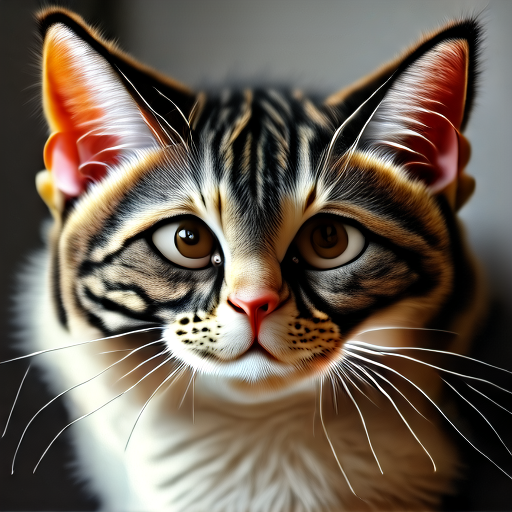 | 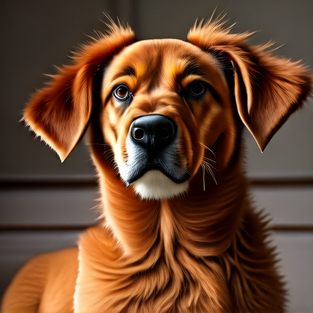 |  |  |
|---|---|---|---|
| A cat | A dog | A cat holding a sign that says hello world | A lovely corgi is taking a walk under the sea |
|  |  | 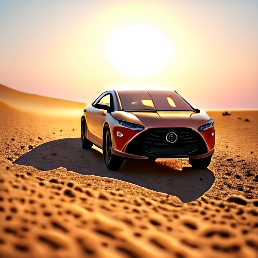 |  |
| Highly detailed anime landscape | Vibrant anime mountain lands | A car running on sand | Fruit cream cake |
| 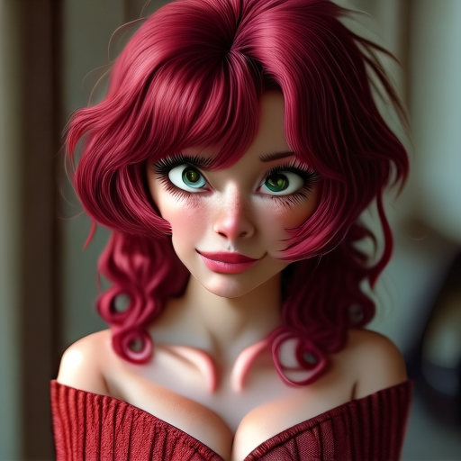 |  | 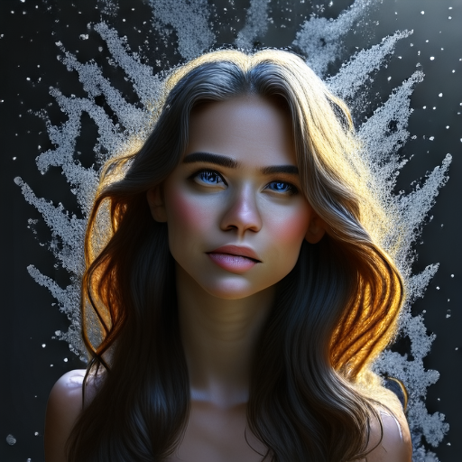 | 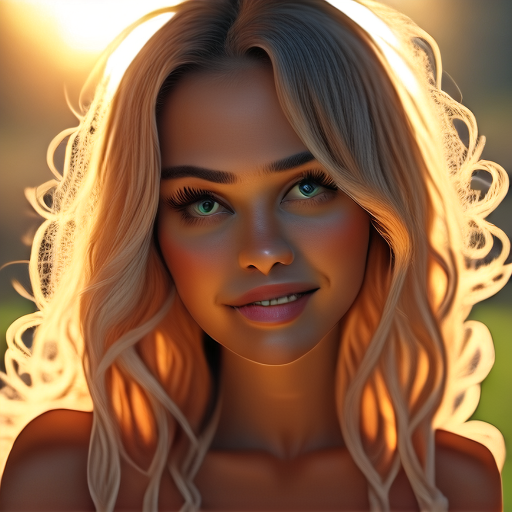 |
| Anime-style portrait | Girl in a white dress under an apple tree | Hair flowing like a waterfall | Beautiful girl with golden hair |

### CNN Series

- MNIST handwritten digit recognition based on CNN.
- CIFAR-10 classification demos based on VGG16 and ResNet.


### YOLO Object Detection

- YOLO object tracking with DeepSORT.
- YOLOv3 mask-wearing detection.
- YOLOv3 helmet detection.
- YOLOv7 smart freezer product recognition.

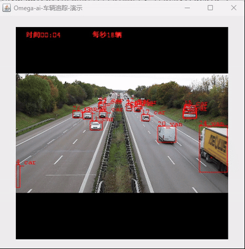


### GAN Series

- GAN demo for MNIST handwritten digit generation.
- DCGAN demo for anime avatar generation.


### RNN and Seq2Seq

- RNN Chinese novel generator.
- LSTM sequence modeling demos.
- Seq2Seq English translation demo.


### GPT and LLaMA Series

- Mini GPT-2 Chinese novel generator.
- GPT-2 Chinese chatbot trained on 500K daily conversation samples.
- GPT-2 medium medical question-answering system trained on 200K medical QA samples.
- LLaMA2 medium medical QA system.
- LLaMA 3.1 chatbot.
- BPE and SentencePiece tokenizer support.


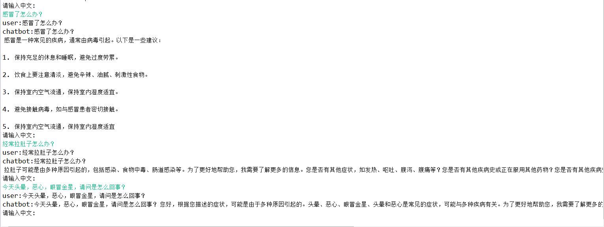

### Diffusion and Stable Diffusion

- Diffusion model for anime avatar generation.
- VQ-VAE training and reconstruction demos.
- Stable Diffusion text-to-image training and inference demos.
- Omega Mini DiT training and inference examples.


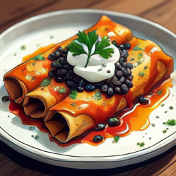

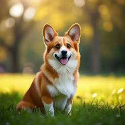

## Supported Components

### Layer Types

Omega-AI includes common neural network layers such as input, fully connected, convolution, transposed convolution, pooling, batch normalization, layer normalization, route/shortcut, dropout, embedding, recurrent blocks, attention blocks, Transformer blocks, YOLO layers, VAE layers, and DiT/Stable Diffusion-related modules.

### Activation Layers

Supported activations include ReLU, LeakyReLU, Sigmoid, Tanh, SiLU, Swish, GELU, and related GPU kernels.

### Normalization and Regularization

The framework provides batch normalization, layer normalization, group normalization, RMS normalization, dropout, and several GPU-accelerated variants.

### Optimizers

Supported optimizers include SGD-style optimizers and AdamW-style optimizers used across the examples.

### Loss Functions

The project includes MSE, MSE sum, binary cross entropy, BCE with logits, cross entropy, softmax with cross entropy, multi-label soft margin, hinge loss, smooth L1 loss, YOLO losses, and task-specific losses implemented in Java/CUDA.

### Learning Rate Schedules

The training utilities include multiple learning-rate update strategies such as random, polynomial, step, exponential, sigmoid, warmup, and fixed/no-update modes.

### Data Loading

The repository contains data loaders for images, labels, binary latent files, text datasets, tokenized language-model datasets, YOLO datasets, VAE datasets, and video/image experiments.

## Built-in Datasets

The repository includes small example datasets under the project resources, such as Iris and MNIST files, for quick demos and tests.

Additional larger datasets used by the YOLO, GPT, LLaMA, Diffusion, Stable Diffusion, and DiT demos must be downloaded separately according to the corresponding example code.

## Example Entry Points

The Chinese README contains long runnable snippets for many demos. In the source tree, the main examples are organized under `src/main/java/com/omega/example`.

Common example groups include:

- `com.omega.example.cnn`
- `com.omega.example.resnet`
- `com.omega.example.yolo`
- `com.omega.example.gan`
- `com.omega.example.rnn`
- `com.omega.example.transformer`
- `com.omega.example.sd`
- `com.omega.example.vae`
- `com.omega.example.dit`
- `com.omega.example.opensora`

Omega Mini DiT has hardware and dataset requirements:

- Tiny version: RTX 3090 24 GB or better is recommended.
- Mini version: NVIDIA L40 48 GB or better is recommended.
- Mini training data: about 2M image-text pairs.
- Tiny training data: about 100K image-text pairs.

The training workflow in the original README is:

1. Generate VA-VAE latent vectors such as `vavae_latend.bin`.
2. Generate text-condition encodings such as `full_clip.bin`.
3. Pre-train the DiT model at 256x256 resolution.
4. Fine-tune at 512x512 resolution.
5. Run inference with CLIP, VA-VAE, DiT, and ICPlan sampling.

## Roadmap

Planned and ongoing work includes broader model support, more visual training tools, dynamic hyperparameter adjustment, and more complete training-status visualization.

## Extra Demo

AI racing game based on neural networks and a genetic algorithm:

```text
http://119.3.123.193:8011/AICar
```

## Version History

### omega-engine-v3

#### 2022-06-20

- Added GPU support through JCuda and cuBLAS SGEMM.
- Optimized convolution as im2col + GEMM.
- Added a VGG16 demo with CIFAR-10 accuracy around 86.45%.
- Added JDK ForkJoin task splitting for CPU-side array operations.
- Added learning-rate update strategies including random, polynomial, step, exponential, sigmoid, and warmup.
- Added BasicBlock and ResNet support, with CIFAR-10 accuracy around 91.23% after 300 epochs.

### omega-engine-v3-gpu

#### 2022-07-02

- Started the full GPU version of Omega Engine.
- Optimized convolution forward and backward computation.

#### 2022-08-17

- Completed the first GPU transformation of convolution layers.
- Added `Im2colKernel.cu` and `Col2imKernel.cu`.
- Added a CUDA memory manager to reduce repeated allocation and host-device transfers.

#### 2022-09-02

- Optimized batch-normalization gradient computation.
- Changed data layout to improve GPU efficiency and reduce format conversion.
- Updated CUDA kernels for faster training and inference.

### omega-engine-v4-gpu

#### 2023-01-10

- Started the cuDNN-enabled version of Omega Engine.
- Added global average pooling.
- Added softmax-with-cross-entropy as a combined loss layer.
- Added cuDNN support for batch normalization.

#### 2023-04-13

- Added cuDNN support with about 4x overall speed improvement in training and inference demos.
- Optimized memory usage for batch-normalization and activation layers, reducing memory use by roughly 30%-40%.
- Added YOLOv1 object detection.
- Added image drawing utilities for predicted boxes and visualization.

#### 2023-08-02

- Added automatic differentiation for CPU and GPU.
- Added multi-label soft margin loss and YOLOv3 loss.
- Added YOLOv3 object detection.
- Added detection data augmentation including random cropping, random flipping, and HSV transforms.
- Reimplemented MSN loss with automatic differentiation.

#### 2023-12-01

- Added YOLOv4 and YOLOv7 implementations.
- Added YOLOv7-tiny smart freezer product-recognition demo.
- Added SiLU activation.
- Updated YOLO layer box scaling to reduce numerical instability.
- Added GAN demos for handwritten digits and anime avatars.
- Added RNN, LSTM, and GRU base modules.

#### 2024-05-20

- Added LSTM model demos for novel generation.
- Added Seq2Seq model demos for Chinese-English translation.
- Added GPT-family Transformer support, including multi-head self-attention, fast causal self-attention, MLP, ID embeddings, and layer normalization.
- Added Nano GPT-2 Shakespeare generation demo.
- Added GPT-2 Chinese chatbot demo.
- Added GPT-2 Chinese medical QA demo.
- Added BPE tokenizer support.

## Contact

- QQ: `465973119`
- Technical discussion QQ group: `119593195`
- Email: `465973119@qq.com`

If this project is useful to you, please consider giving Omega-AI a star.
