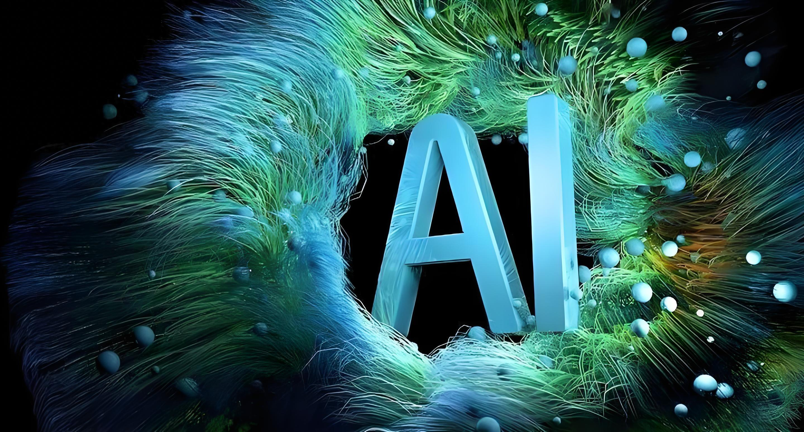

	

<h1 align="center" style="margin: 30px 0 30px; font-weight: bold;">Omega-AI v1.30.0</h1>
<h5 align="center">基于 Java 打造的 Omega-AI 深度学习框架，支持多种神经网络及模型构建除 cuda 和 cudnn 相关依赖，无其他 API 及第三方依赖包！</h5>

	
	
	
	
	
	
	<!--  -->
	

---

## 前言：️️
为了保证新同学不迷路，请允许我唠叨一下：无论您从何处看到本篇文章，最新开发文档永远在：[https://omega-ai.dromara.org](https://omega-ai.dromara.org)，
建议收藏在浏览器书签，如果您已经身处本网站下，则请忽略此条说明。

本文档将会尽力讲解每个功能的设计原因、应用场景，用心阅读文档，你学习到的将不止是 `Omega-AI` 深度学习框架本身，更是能够通过此框架完成绝大多数场景最佳实践。

## Omega-AI 介绍

**Omega-AI** 是基于Java打造的深度学习框架，框架目前支持**BP神经网络**、**卷积神经网络**、**循环神经网络**、**Vgg16**、**Resnet**、**Yolo**、**Lstm**、**transformer**、**Tpt**、**Llama**、**diffusion**、**stable diffusion**
等模型的构建，目前引擎最新版本支持CUDA和CUDNN两种GPU加速方式，关于GPU加速的环境配置与jcuda版本jar包的对应依赖，引擎中所实现的模型和算法，**除了使用cuda和cudnn相关依赖包之外均不使用任何API和第三方依赖包**。

当你长期使用Java进行开发期望转向AI赛道后，你就会明白，相对于这些传统老牌Python深度学习框架，Omega-AI 的 API 设计是多么的亲切！

## Omega-AI  功能一览

Omega-AI 目前主要五大功能模块：神经网络、网络层、激活函数、损失函数、学习率更新器。

- **神经网络** —— BPNetwork bp神经网络、CNN卷积神经网络、RNN 循环神经网络、LSTM 长短期记忆网络……多种神经网络全Java实现。
- **网络层** —— Fullylayer全连接层、ConvolutionLayer卷积层、RouteLayer 路由层等…… 提供完善的网络层类型从零到一方案。
- **激活函数** —— ReluLayer、LeakyReluLayer、TanhLayer、SigmodLayer、SiLULayer……多种激活函数纯手撸。
- **损失函数** —— MSELoss、CrossEntropyLoss、CrossEntropyLossWithSoftmax、MultiLabelSoftMargin……多种灵活损失函数实现。
- **归一化** —— 提供BNLayer批归一化、LNLayer 层归一化、InstanceNormaliztionLayer 实例归一化、RMSLayer 均方根归一化。
- **优化器** —— 内置多种优化器，适配Momentum、Sgd、Adam等场景。
- **训练器** —— 实现MBSGDOptimizer训练器，提供给小白直接使用。
- **学习率更新器** —— 实现CONSTANT、LR_DECAY、GD_GECAY、POLY等学习率覆盖CV到LLM模型。

功能结构图(紧密开发中)：

## 开源仓库 Star 趋势

如果 Omega-AI 帮助到了您，希望您可以为其点上一个 `star`：
[码云](https://gitee.com/dromara/omega-ai)、
[GitHub](https://github.com/dromara/omega-ai)

## 使用Omega-AI的开源项目 
参考：[Omega-AI 生态](/doc/more/link)

## 交流群
加入 Omega-AI 框架 QQ、微信讨论群：[点击加入](/doc/more/join-group.md)

