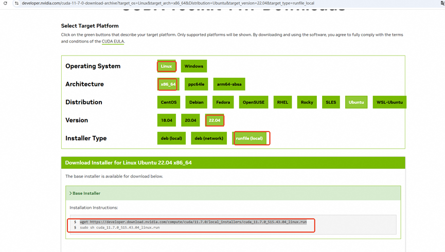

# cuda安装


<!---------------------------- tabs:start ---------------------------->
<!-------- tab:windows -------->
### 1.CUDA安装
#### 1.1.CUDA作用
CUDA 是 NVIDIA 提供的并行计算平台和编程模型，允许开发者直接利用 GPU 的并行计算能力，而无需编写底层图形API（如OpenGL）。通过扩展 C/C++/Python 等语言，CUDA 使得开发者可以编写直接在 GPU 上运行的代码（称为核函数），适用于任何需要大规模并行计算的任务，如科学模拟、图像处理、深度学习等。

#### 1.2.CUDA下载
使用cmd:

```
nvidia-smi
```

显示如下： 

CUDA version12.2表示当前驱动最多支持到 CUDA Toolkit 12.2，但通常也向下兼容更低的 CUDA Toolkit 版本。

NVIDIA 驱动通常支持 所有 ≤ 驱动标称版本 的 CUDA Toolkit。例如：


- 驱动版本 12.4 → 支持 CUDA Toolkit 12.x、11.x、10.x 等。
- 但具体兼容范围需参考 NVIDIA 官方文档。


为了omega-ai项目更好的兼容性，我们这里安装CUDA 11.7版本，地址：https://developer.nvidia.com/cuda-11-7-0-download-archive


#### 1.3.CUDA安装
执行exe按照图形界面一步步安装即可。

#### 1.4.验证

```
nvcc --version  # 查看 CUDA 编译器版本
```

如下说明安装成功： 


### 2.CUDNN安装
#### 2.1.CUDNN作用
   cuDNN 是 NVIDIA 针对深度学习优化的高性能库，基于 CUDA 构建，提供了高度优化的常见深度学习操作实现。针对卷积（Convolution）、池化（Pooling）、归一化（BatchNorm）、激活函数（ReLU等）、循环神经网络（RNN/LSTM）等操作进行了极致优化，显著提升训练和推理速度。主流深度学习框架（如 TensorFlow、PyTorch）依赖 cuDNN 作为底层计算引擎。

#### 2.2.下载
下载最新的11.7 cuDNN，地址：

https://developer.download.nvidia.cn/compute/cudnn/redist/cudnn/windows-x86_64


#### 2.3.安装
1.解压下载的 .zip 文件（如 cudnn-windows-x86_64-8.x.x.x_cuda12.x.zip）。

2.将解压后的文件夹中的内容复制到 CUDA 安装目录：

- 复制 bin\* 到 C:\Program Files\NVIDIA GPU Computing Toolkit\CUDA\v12.x\bin
- 复制 include\* 到 CUDA\v12.x\include
- 复制 lib\x64\* 到 CUDA\v12.x\lib\x64

至此安装完毕。 

#### 2.4.验证
    进入 CUDA 的安装目录（默认路径如C:\Program Files\NVIDIA GPU Computing Toolkit\CUDA\v11.7\），分别进入include和lib文件夹，查看是否存在以cudnn开头的文件，如cudnn.h和cudnn.lib等。也可以运行 CUDA 安装目录下extra\demo_suite文件夹中的deviceQuery.exe和bandwidthTest.exe文件 ，在命令行中进入该文件夹目录，然后依次执行以下命令：

```
.\deviceQuery.exe
.\bandwidthTest.exe
```

 若两个程序的输出结果中都出现Result = PASS，则说明 cuDNN 安装和配置正确。


<!------------- tab:linux  ------------->
### 1.CUDA安装
#### 1.1.CUDA作用
   CUDA 是 NVIDIA 提供的并行计算平台和编程模型，允许开发者直接利用 GPU 的并行计算能力，而无需编写底层图形API（如OpenGL）。通过扩展 C/C++/Python 等语言，CUDA 使得开发者可以编写直接在 GPU 上运行的代码（称为核函数），适用于任何需要大规模并行计算的任务，如科学模拟、图像处理、深度学习等。

#### 1.2.CUDA下载
查看CUDA驱动：

```
nvidia-smi
```

显示如下：


CUDA version12.4表示当前驱动最多支持到 CUDA Toolkit 12.4，但通常也向下兼容更低的 CUDA Toolkit 版本。

NVIDIA 驱动通常支持 所有 ≤ 驱动标称版本 的 CUDA Toolkit。例如：

驱动版本 12.4 → 支持 CUDA Toolkit 12.x、11.x、10.x 等。

但具体兼容范围需参考 NVIDIA 官方文档。

 为了omega-ai项目更好的兼容性，我们这里安装CUDA 11.7版本，地址：https://developer.nvidia.com/cuda-11-7-0-download-archive?target_os=Linux&target_arch=x86_64&Distribution=Ubuntu&target_version=22.04&target_type=runfile_local

注意：如果机器已经有12.4的CUDA Tookit了，不影响本次11.7的安装，可以安装多个版本。




```
wget https://developer.download.nvidia.com/compute/cuda/11.7.0/local_installers/cuda_11.7.0_515.43.04_linux.run
```

1.3.CUDA安装 
执行linux命令安装:


```
sudo sh cuda_11.7.0_515.43.04_linux.run
```


 第一步：输入accept，回车


 第二步：选择drive，回车，取消驱动安装，再选择install安装


 显示如下安装成功：


 查看安装日志：

```
cat /var/log/cuda-installer.log
```


遇到 "Cannot find manpages to install" 的警告或错误，通常是因为CUDA安装包缺少manpages（手册页）文件，或者安装程序无法找到它们。如果不需要查阅CUDA的man手册，可以直接忽略此警告。我们这里忽略 ！如果你确实需要查阅CUDA的man手册，你可以在此https://developer.download.nvidia.cn/compute/cuda/redist/cuda_documentation/linux-x86_64/下载相同版本的documentation安装。

#### 1.4.验证

```
nvcc --version  # 查看 CUDA 编译器版本
```

 如下说明安装成功：


### 2.CUDNN安装
#### 2.1.CUDNN作用
   cuDNN 是 NVIDIA 针对深度学习优化的高性能库，基于 CUDA 构建，提供了高度优化的常见深度学习操作实现。针对卷积（Convolution）、池化（Pooling）、归一化（BatchNorm）、激活函数（ReLU等）、循环神经网络（RNN/LSTM）等操作进行了极致优化，显著提升训练和推理速度。主流深度学习框架（如 TensorFlow、PyTorch）依赖 cuDNN 作为底层计算引擎。

#### 2.2.下载  
https://developer.download.nvidia.cn/compute/cudnn/redist/cudnn/linux-x86_64/


#### 2.3.安装 

```
tar -xvf cudnn-linux-x86_64-9.10.0.56_cuda11-archive.tar.xz
cd cudnn-linux-x86_64-9.10.0.56_cuda11-archive
sudo cp -r include/* /usr/local/cuda-11.7/include/
sudo cp -r lib/* /usr/local/cuda-11.7/lib64/
```

#### 2.4.验证
        进入 CUDA 的安装目录（默认路径如/usr/local/cuda-11.7），分别进入include和lib文件夹，查看是否存在以cudnn开头的文件，如cudnn.h和cudnn.lib等。也可以运行 CUDA 安装目录下extra\demo_suite文件夹中的deviceQuery和bandwidthTest文件 ，在命令行中进入该文件夹目录，然后依次执行以下命令：

```
./deviceQuery
./bandwidthTest
```

 若两个程序的输出结果中都出现Result = PASS，则说明 cuDNN 安装和配置正确。


<!---------------------------- tabs:end ---------------------------->


